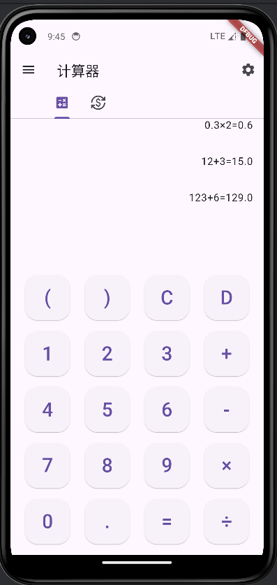

# 这是一个简单的计算器

在android/gradle/wrapper/gradle-wrapper.properties文件中， 将distributionUrl的值修改为
distributionUrl=https\://services.gradle.org/distributions/gradle-7.6.3-all.zip

drawer

汇率转换，输入之后即时刷新

设置

弹窗广告

夜间模式

drop down menu

AboutDialog

hero动画

exit

